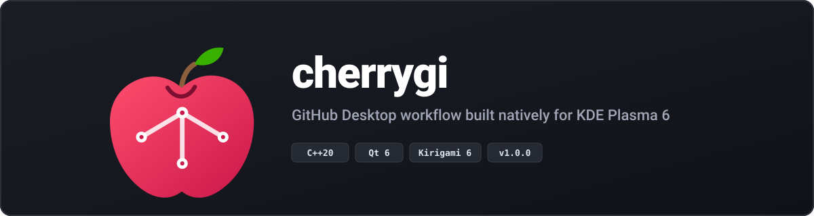
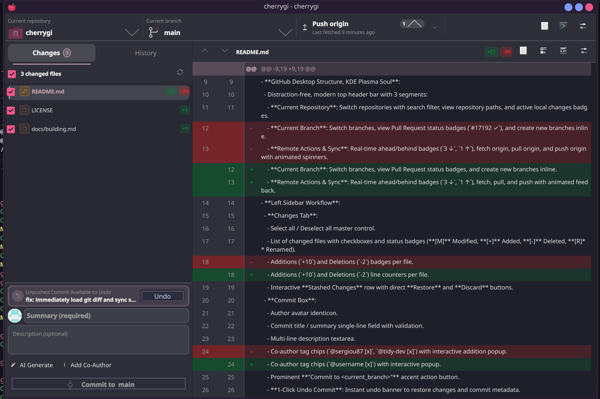

<p align="center">
  
</p>

<p align="center">
  <a href="https://github.com/sillygru/cherrygi/actions/workflows/build.yml"></a>
  <a href="https://github.com/sillygru/cherrygi/releases/latest"></a>
  <a href="https://kde.org"></a>
  <a href="https://qt.io"></a>
  <a href="LICENSE"></a>
</p>

---

# cherrygi 🍒

A fast, native Git client for KDE Plasma 6 that brings the straightforward workflow of GitHub Desktop to the Linux desktop without Electron. Built in C++20 with Qt 6 and Kirigami, CherryGI integrates directly into your system theme, uses your system fonts and icons, and starts instantly.

<p align="center">
  
</p>

---

## Why CherryGI?

GitHub Desktop hit on a clean, productive layout for day-to-day Git operations: quick repository switching, immediate diff inspection, single-click branch switching, and a focused commit box. On Linux, however, running web-based desktop wrappers often means sluggish startup, heavy memory consumption, and a UI that clashes with system color schemes.

CherryGI is a native desktop application from the ground up:

- **Starts immediately**: Reads `.git` directories directly in C++ for branch lists, history, and status without spawning subshells on every click.
- **True Plasma integration**: Adopts your active Breeze color palette, system icons, and Qt Quick rendering pipeline.
- **Focused workflow**: Stages files per-line or per-file, tracks stashes, generates AI commit messages when configured, and lets you undo recent commits with one click.

---

## Key Features

### Header and Branch Control
- **Three-segment header**: Switch active repositories, checkout or create branches, and push/pull from remotes in one bar.
- **Upstream sync status**: Live indicators for commits ahead and behind upstream with animated push/pull progress.
- **Direct GitHub integration**: Open current branches, repositories, or Pull Request creation pages directly in your browser.

### Changes & History
- **Staging control**: Checkbox selection for precise staging, per-file addition/deletion counters, and file status badges.
- **Stash management**: View, inspect, restore, or drop stashes directly from the sidebar.
- **Commit creation**: Identicon avatar, summary input with length indicator, multi-line description, and co-author tag chips.
- **Commit history search**: Filter commits across messages, commit SHAs, and author names.

### Diff Viewer & Inspectors
- **Unified and split diffs**: Switch between inline and side-by-side comparison modes.
- **Image diffs**: Visual side-by-side inspection for modified graphic assets.
- **Commit inspector**: Review metadata, copy full commit hashes, and inspect changes made in past revisions.

### AI Commit Assistant
- Optional integration with OpenAI, Ollama, Anthropic, or local endpoints.
- Formats commit suggestions according to Conventional Commits, imperative summary, or repository history conventions.

---

## Quickstart & Installation

### Requirements
- Linux (KDE Plasma 6 recommended)
- Qt 6.5 or later (Core, Gui, Qml, Quick, QuickControls2, QuickEffects, Widgets, Network)
- KDE Frameworks 6 (Kirigami, CoreAddons, I18n, IconThemes, ColorScheme, Config)
- CMake 3.20+ and a C++20 compiler (GCC 12+ or Clang 15+)
- Git 2.30+

### Build from Source

```bash
# Clone repository
git clone https://github.com/sillygru/cherrygi.git
cd cherrygi

# Configure and compile
cmake -B build -DCMAKE_BUILD_TYPE=Release
cmake --build build --parallel

# Run
./build/cherrygi
```

### Install System-wide

```bash
sudo cmake --install build
```

---

## Keyboard Shortcuts

| Shortcut | Action |
| :--- | :--- |
| `Ctrl + R` / `F5` | Refresh repository status |
| `Ctrl + P` | Push changes to remote |
| `Ctrl + Shift + P` | Pull changes from remote |
| `Ctrl + Shift + F` | Fetch latest remote commits |
| `Ctrl + Enter` | Commit staged changes |
| `Ctrl + Z` | Undo last local commit (when available) |
| `Ctrl + ,` | Open Settings and Preferences |
| `Escape` | Close active dialog or popup |

---

## Documentation

- [Build & Installation Guide](docs/building.md)
- [Architecture Overview](docs/architecture.md)
- [UI & Theming Guide](docs/ui_guide.md)
- [Git Backend Transition](docs/git_service_transition.md)

---

## License

CherryGI is licensed under the [GNU General Public License v3.0 or later (GPL-3.0-or-later)](LICENSE).
